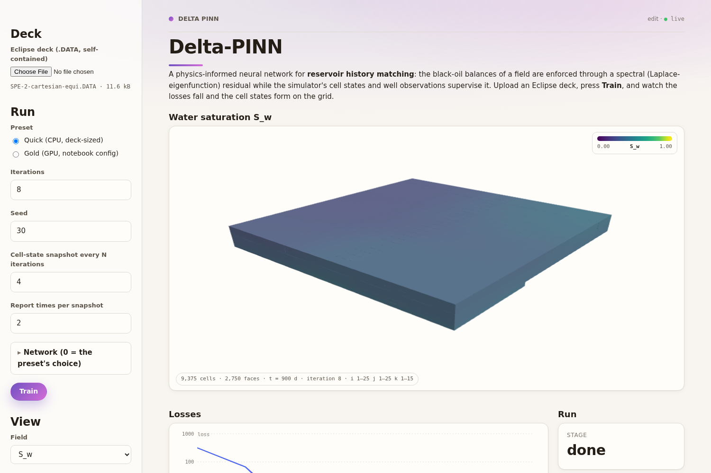

# gNN — a PERD workflow

A physics-informed neural network for **reservoir history matching**. The black-oil balances of a field are enforced through a spectral (Laplace-eigenfunction) residual on the reservoir's own hexahedral grid while the simulator's cell states and the wells' observed rates supervise the network. The only input is one Eclipse deck; from it the workflow runs the reference simulation (OPM Flow), extracts the grid, rock, cell states and wells through ResInsight, builds the finite-element operators and the eigenbasis, and trains — streaming the losses and the predicted cell states to the app page as it goes.

It is the second PERD app after [DCA_PINN](https://github.com/Mechtanium/DCA_PINN) and the one that exercises the heavy parts of the platform: a build-time `setup.sh`, an input stream for the deck, multi-megabyte output items, a 3-D page element and a GPU compute class. The training code is a trimmed, bit-identical extraction of the research notebook `PINN-Lab.ipynb`'s gold-standard configuration (see [tests/parity](tests/parity/README.md)).

## What the workflow does

```python
@workflow.bi_di
async def train(
    chunks: WorkflowStreamInput[bytes],    # the deck, in ≤ 1 MiB pieces
    deck_name: str = "deck.DATA",
    preset: str = "gold",                  # "gold" (the notebook config) | "quick" (deck-sized, CPU)
    n_iter: int = 20000, seed: int = 30,
    m_width: int = 0, n_blocks: int = 0, n_eig: int = 0,   # 0 = the preset's choice
    log_every: int = 1, snapshot_every: int = 50, n_snapshots: int = 8,
) -> WorkflowStreamOutput[str, int, float, float, float, float, float, str]:
    # one item = (kind, iteration, total, pde, ic, data, well, payload_json)
```

Every output item has a `kind`:

| kind | when | payload |
|---|---|---|
| `stage` | as the pipeline moves: simulate → prep → resolve → build → train → done | `{"stage", "message"}`; the `total` slot carries the fraction done |
| `grid` | once, before the first optimizer step (in parts if the field is large) | corners of every cell (float32, VTK order), i-j-k addresses, the snapshot times, the fixed colour range of every field, the wells' perforated cells |
| `loss` | every `log_every` iterations | the five losses ride in the numeric slots; `{"wall_s", "eta"}` |
| `state` | at iteration 0, every `snapshot_every` iterations and at the end, one per snapshot time | `S_w, S_o, S_g, p_o, p_w, p_g, R_so` for every cell (float16, clipped into the fixed ranges) |
| `metrics` | at the end | pressure and saturation RMSEs against the simulator |
| `error` | instead of a crash | `{"message"}` |

The two presets are in [modules/presets.py](modules/presets.py). **Gold** is the notebook's configuration (`n_eig=5`, DGM `16×2`, 20 000 ENGD iterations, about 20 s per iteration on a T4). **Quick** keeps every component and physics setting but lets the sizes follow the deck: the eigenbasis width from the automatic addressability floor and the network width and depth from a parameter target of 800, so a smoke run finishes in minutes on a CPU workstation (SPE-2: about 2 s per iteration on two CPU cores after a cold start of roughly four minutes — 60 s of Flow, 25 s of ResInsight, 55 s of eigensolve and two minutes of XLA compilation; every one of those is cached per deck under the work directory, so a second run on the same deck starts training in about two minutes).

## The app page

[page.py](page.py) is laid out like ResInsight: the left pane holds the deck upload, the preset, the iteration count, the seed, the snapshot cadence `N` and the **Train** button, then the view controls (field, snapshot time, Z scale and the i/j/k slice ranges); the right pane shows the reservoir as solid hexahedral cells coloured on a fixed legend on top, and the five losses on a log-Y chart with the run's metrics below. Slicing keeps the interior in view: cutting at `k = 7` removes the layers below and shows the cut surface coloured by those cells' values. The legend of each field is the simulator's range widened by 1.5 standard deviations on each side; predictions beyond it are clipped, so the colours never rescale mid-run.



## Publishing it on PERD

Push this repository to GitHub, sign in on the PERD website, open **Store → Publish from GitHub**, paste the URL and choose the workflow id. The image build runs [setup.sh](setup.sh) as root before the Python installs — that script is where every ResInsight detail lives (the Debian libraries the binary needs, the pinned nightly zip verified by SHA-256, the `xvfb` wrapper `rips` launches, a writable `HOME` for the non-root user); the platform knows nothing about ResInsight. The image is about 5 GB (JAX CUDA, ResInsight, OPM Flow), so give the build a 3600 s timeout and an 8-vCPU machine. Launch the app on the **GPU T4** class with a three-day lease for gold runs; the quick preset runs on any class.

The ResInsight zip is a release asset of this repository (`resinsight-2026.07`), never a git object; `setup.sh` falls back to the nightly link if the asset is missing and refuses anything whose checksum differs.

## Running it locally

```bash
pip install -r requirements.txt 'perd-worker[page]'
export RESINSIGHT_EXECUTABLE=/opt/ResInsight/bin/resinsight-xvfb   # or a ResInsight nightly on this machine
python -m perd_worker.serve --module workflow --name delta_pinn --port 50051
python -c "from perdlit._script import check_page; print(check_page('page', 'workflow'))"
```

The work directory is `$DELTA_PINN_WORK` (default `/tmp/delta_pinn`), one folder per deck: the deck, Flow's results, the preprocessing cache and the spectral cache.

## Tests

```bash
pytest tests -q                                   # message encoding, OPM Flow on SPE1 (twice in one process), every referenced name defined
RESINSIGHT_EXECUTABLE=… pytest tests -q -m slow   # SPE1 deck → Flow → ResInsight → 5 quick iterations (DELTA_PINN_DECK= for another deck)
DECK=… RESINSIGHT_LOCAL_ZIP=… tests/test_resinsight_container.sh    # the image recipe in docker, as uid 10001
```

`tests/data` vendors two open decks: SPE1CASE1 (OPM's, ODbL; 300 cells, `DATES`/`WCONINJE` blocks) and SPE-2 (9 375 cells). They cover different parser branches — a helper the trim had deleted (`_parse_wconinje_row`) was invisible on SPE-2 and fatal on SPE1, which is what `tests/test_static.py` now guards.

[tests/parity](tests/parity) holds the developer scripts that prove the extracted pipeline is bit-identical to the research notebook's.

## Layout

- `workflow.py` — the `train` operation (light imports at the top; the heavy ones inside).
- `page.py` — the perdlit page.
- `modules/` — the training pipeline: `presets`, `config`, `pipeline`, `training`, `engd`, `spectral`, `wells`, … and the streaming spine `stream.py` / `frames.py`; `modules/simulate.py` (OPM Flow) and `modules/prep.py` (ResInsight through `rips`).
- `modules/utils/` — the mesh, the extractor (rips backend), the preprocessing cache, the black-oil closures, the FEM assembly and the eigenbasis.
- `field/` — the vendored deck-table parser, trimmed to what the extractor needs.
- `setup.sh`, `requirements.txt` — the image recipe.

## License

See [LICENSE](LICENSE).
